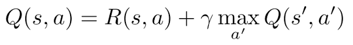
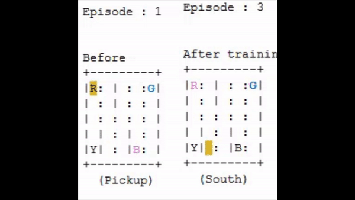

<h1>Q-Learning</h1>

Q-learning is a model-free reinforcement learning algorithm to learn a policy telling an agent what action to take under what circumstances. It does not require a model (hence the connotation "model-free") of the environment, and it can handle problems with stochastic transitions and rewards, without requiring adaptations 
 
A model-free algorithm is an algorithm that estimates the optimal policy without using or estimating the dynamics (transition and reward functions) of the environment. Whereas, a model-based algorithm is an algorithm that uses the transition function (and the reward function) in order to estimate the optimal policy.

<h2>Q-Learning Steps</h2>

<ol>
<li>Create a q-table that follows the shape of [state, action] and we initialize the q-table with random values.</li>
<li>The agent select an action, it can select action from q-table which contain the highest q-value for a state, or select a random action and discover new states.
<li>The agent interact with the environment and make updates to the state action pairs in our q-table Q[state, action] with formula:</li>

<li> Loop for large amount of episodes so eventually it will converge to optimal q-value</li></op>

For further read about q-learning, you can read this superb <a href="https://link.springer.com/content/pdf/10.1007/BF00992698.pdf">technical note </a>from <a href="http://www.cs.rhul.ac.uk/~chrisw/">Chris Watkins</a> and <a href="https://www.ed.ac.uk/profile/peter-dayan">Peter Dayan</a>.

<h2>Q-Learning for Taxi problem from Openai gym</h2>

 The Taxi Problem
    from "Hierarchical Reinforcement Learning with the MAXQ Value Function Decomposition"
    by <a href="https://eecs.oregonstate.edu/people/dietterich-thomas">Tom Dietterich</a>
    Description:
    There are four designated locations in the grid world indicated by R(ed), G(reen), Y(ellow), and B(lue). When the episode starts, the taxi starts off at a random square and the passenger is at a random location. The taxi drives to the passenger's location, picks up the passenger, drives to the passenger's destination (another one of the four specified locations), and then drops off the passenger. Once the passenger is dropped off, the episode ends.
    Observations: 
    There are 500 discrete states since there are 25 taxi positions, 5 possible locations of the passenger (including the case when the passenger is in the taxi), and 4 destination locations. 
    
    Passenger locations:
    - 0: R(ed)
    - 1: G(reen)
    - 2: Y(ellow)
    - 3: B(lue)
    - 4: in taxi
    
    Destinations:
    - 0: R(ed)
    - 1: G(reen)
    - 2: Y(ellow)
    - 3: B(lue)
        
    Actions:
    There are 6 discrete deterministic actions:
    - 0: move south
    - 1: move north
    - 2: move east 
    - 3: move west 
    - 4: pickup passenger
    - 5: dropoff passenger
    
    Rewards: 
    There is a default per-step reward of -1,
    except for delivering the passenger, which is +20,
    or executing "pickup" and "drop-off" actions illegally, which is -10.
    
    Rendering:
    - blue: passenger
    - magenta: destination
    - yellow: empty taxi
    - green: full taxi
    - other letters (R, G, Y and B): locations for passengers and destinations
    
    state space is represented by:
    (taxi_row, taxi_col, passenger_location, destination)

